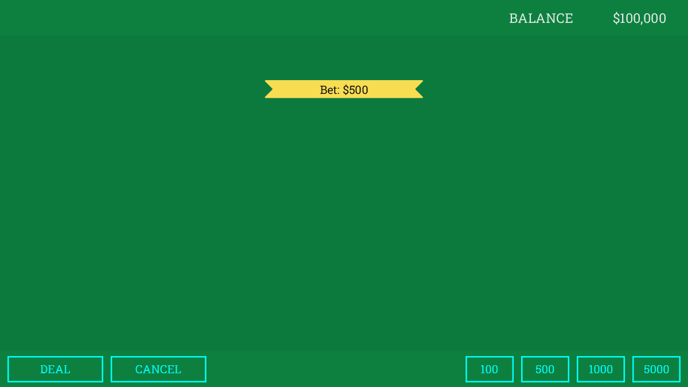
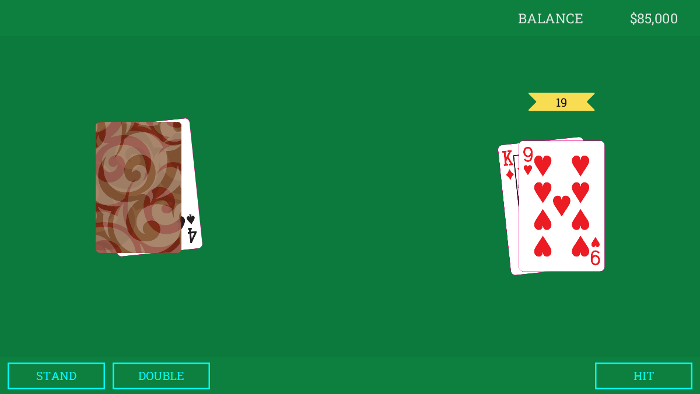
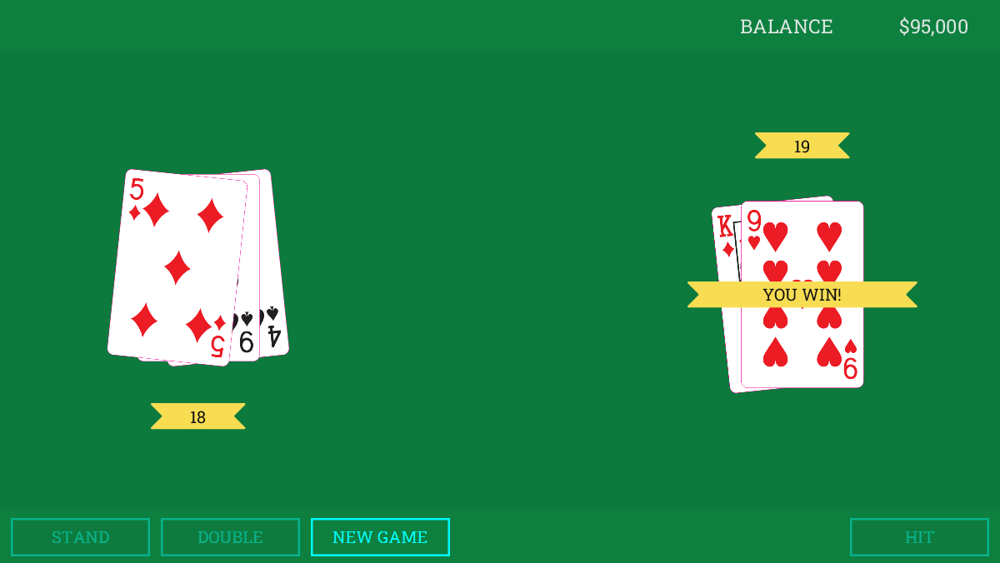

# Blackjack Game

A single-player blackjack game designed using
OOAD practices, powered by **JavaFX**.

## Features

The application contains two scene: playroom-bet-view and playroom-game-view,
each has a corresponding controller manipulating the Game, the Player, the
Dealer and the Deck! Player can stand, double or hit during the game.
Splitting is not yet supported.

## Setup development environment

The project is built with **JavaFX**. To set up a development environment,
and to have a well understanding on JavaFX project structure, check
[Help On JavaFX](https://jetbrains.com/help/idea/javafx.html)
from *IntelliJ IDEA Edu* for reference!

## Build and package

You can run this project by clicking on the maven target `javafx:run` if
everything has set up correctly in `pom.xml`. However, if you wish to
build this project into a one-click executable, you need to manually set
up an artifact in **Project Structure...** in IDEA.

Before doing custom packaging, you need to
[download](https://gluonhq.com/products/javafx/) OpenJFX since JavaFX is
no longer bundled in JDK from version 9. OpenJFX version 17 is recommended.

Steps to produce a standalone jar executable:

1. In **Project Structure**, go to **Artifacts** tab on the left.
2. Click the **+** button at the top, select **JAR** |
   **From modules with dependencies...**
3. Select the alternative **Main Class** which is NOT extended from
   `Application` class (a packaging bug workaround), in this case,
   `BlackjackLauncher`. Then click **OK**.
4. In the artifact setup you just created, click the **+** (Add Copy Of)
   button in **Output Layout**, select **File**.
5. Browse to the directory where you installed/extracted `javafx-sdk`,
   under `/bin` directory, hold `Shift` and select all `*.dll` files,
   click **OK**.
6. Now you can build the jar in your IDEA by selecting **Build** |
   **Build Artifacts...** | **Build**, the output file is under
   `/out/artifacts`

If you also wish to convert the jar file into a Windows executable,
you can use [launch4j](http://launch4j.sourceforge.net/).
